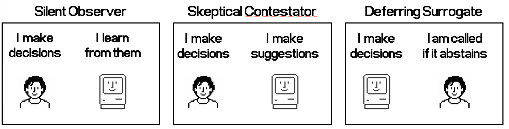

# iRAG

iRAG is an experimental human-in-the-loop decision-support system for settings
where a Retrieval-Augmented Generation (RAG) knowledge base does not exist in
advance. Instead, the knowledge base starts empty and grows from the final
decisions made while the system is operating. Each new case can therefore use
earlier, human-supervised decisions as precedents, and every final decision is
stored for future retrieval.



The project studies two connected questions:

1. How should decision-making authority move from a human to a language model
   as evidence of the model's reliability accumulates?
2. How should an incremental RAG memory adapt when previously valid knowledge
   changes?

This repository contains the complete experimental service, the two SalesX
concept-drift datasets, precomputed embeddings, analysis tools, independent
baseline implementation, and checked-in paper results. It is a research
prototype rather than a general-purpose RAG framework: experiment requests are
restricted to SalesX records whose IDs and exact question text match the
precomputed `qwen3-embedding:4b` corpus.

## How iRAG works

For each incoming ticket, iRAG retrieves up to $K$ earlier question--answer
records, asks the language model to answer or abstain, determines who has final
authority, and appends the resulting final decision to the knowledge base.
Authority changes through three states:

| State | Authority and model behaviour |
|---|---|
| **Silent Observer (SO)** | The human decides. A non-abstaining model answer is evaluated silently to build a reliability history. |
| **Skeptical Contestator (SC)** | The human remains responsible, but a conflicting model proposal can be presented and accepted or rejected. |
| **Deferring Surrogate (DS)** | The model normally finalizes the answer and defers to the human when it abstains; human intervention can return control to an earlier state. |

Transitions are governed by Fading Empirical Accuracy (FEA), a recency-weighted
measure of agreement between model proposals and final human decisions. The
minimum evidence requirement $N$ and thresholds $\alpha$, $\beta$, and $\gamma$
control entry into and exit from SC and DS.

iRAG separates two kinds of temporal adaptation:

- `lambda_rag` discounts older knowledge-base records when ranking semantically
  relevant precedents. It governs the retrieval stability--plasticity
  trade-off.
- `lambda_fea` discounts older reliability observations. It governs how quickly
  the authority controller reacts to recent model performance.

Setting either value to `1` disables that form of decay. The paper's coupled
decay condition sets both to `0.99861`, corresponding to a half-life of roughly
500 insertions or reliability observations.

## What the experiments test

The main experiment processes 2,000 SalesX support tickets as four consecutive
quarters of 500 tickets. Quarter order is preserved so that changed answers
remain genuinely temporal, while tickets are shuffled within each quarter for
every seeded repetition. Two dataset variants provide different amounts of
concept drift:

- `drift_10`: 10% of Q2--Q4 tickets use changed knowledge;
- `drift_40`: 40% of Q2--Q4 tickets use changed knowledge.

The paper evaluates a $2\times2$ factorial design. `lambda_rag` and
`lambda_fea` are independently set to decay (`0.99861`) or no decay (`1`),
giving four configurations per dataset. Each configuration uses ten matched
seeds, for eight jobs and 80 nominal repetitions in total.

All paper runs use the informed-mixture assignment. The CEO supplies every Q1
decision to establish a trusted initial memory. In Q2--Q4, the first 100
tickets form a CEO review window; the remaining tickets are assigned among the
CEO, Domain Expert, and Intern according to the experimental profile policy.
State transitions are suspended during trusted review. The paper's
`gold_similarity` acceptance regime is an oracle experimental condition: in
SC, a disputed proposal is accepted only when the auxiliary evaluation already
finds it consistent with the gold answer.

The primary comparison is an independently rolled-out **Controller-free
RAG-with-defer** baseline. It follows the same CEO bootstrap, quarterly review,
ticket order, human assignment, retrieval rule, and model-abstention behaviour,
but has no SO/SC/DS controller or FEA. Its final decisions construct its own
knowledge base, so it is an end-to-end baseline rather than a replay over an
iRAG trajectory.

The optional `Extra` split adds 50 post-Q4 questions designed to be impossible
to answer from the available corpus. It tests whether the model still abstains
after iRAG has reached later authority states and is excluded from the nominal
2,000-ticket paper metrics.

The complete eight-condition trajectory figure is included as
[`paper-results/plots/all-eight-settings.pdf`](paper-results/plots/all-eight-settings.pdf), with a browsable PNG at
[`paper-results/plots/all-eight-settings.png`](paper-results/plots/all-eight-settings.png).
The checked-in [`paper-results/`](paper-results/) directory also contains
per-run metrics, counts, paired tests, effect sizes, final-state frequencies,
seeds, source-result manifests, and the temporal-retrieval benchmark.

## Implementation scope

The runner implements insertion-decayed retrieval, independently decayed FEA,
the semantic gate, SO/SC/DS transitions, simulated profile routing, acceptance
regimes, chronological quarter processing, seeded repetitions, checkpointed
resume, and the independent baseline. The `always_refuse` regime can enter SC
but never DS because a simulated human who never accepts a conflicting model
proposal does not grant it autonomous control.

At `LOG_LEVEL=INFO`, every repetition emits structured JSON events for its
start, each processed ticket, and completion. Ticket events identify the job,
condition, repetition, seed, progress, assigned profile, state transition,
retrieval count, model action, acceptance outcome, final-decision origin and
correctness, FEA, and reliability-observation count. This keeps concurrent
repetitions attributable when their logs interleave.

## Project structure

```text
src/irag/
├── api/          # FastAPI composition and background jobs
├── client/       # Model-provider and Qdrant adapters
├── core/         # Configuration and shared models
├── data/         # SalesX loading and result persistence
├── engine/       # Experiment workflow, retrieval, and temporal pruning
├── tools/        # Analysis, plotting, benchmark, and smoke-test CLIs
├── __init__.py
└── main.py       # Thin ASGI entry point
tests/            # Deterministic test suite
experiment data/ # Quarterly benchmark, post-Q4 abstention split, and embeddings
paper-results/   # Checked-in paper statistics and benchmark measurements
```

## Model providers

Generation and semantic judging can run through any of:

- `ollama`: local models served by Ollama.
- `openrouter`: models exposed through OpenRouter's chat-completions API.
- `bedrock`: AWS models and inference profiles exposed through Bedrock Runtime's Converse API.

Set `MODEL_PROVIDER` and the corresponding model names in `config.env`. OpenRouter additionally requires `OPENROUTER_API_KEY`. For Bedrock Runtime, set `AWS_BEARER_TOKEN_BEDROCK`, or use the standard AWS credential chain or an AWS profile. Credentials and AWS profile selection are configuration-only: they are never accepted in API payloads or written to experiment results.

For Bedrock, the cost-oriented defaults use the EU inference profile for Amazon Nova 2 Lite in both roles. The decision and auxiliary models remain independently selectable, so final runs can use a different auxiliary judge when model independence is important:

```env
MODEL_PROVIDER="bedrock"
AWS_BEARER_TOKEN_BEDROCK="..." # sufficient for Bedrock Runtime calls
BEDROCK_REGION="eu-west-1"
BEDROCK_PROFILE="" # optional alternative: local shared AWS profile
BEDROCK_RETRIES="10" # adaptive SDK attempts for throttling-heavy batch runs
BEDROCK_THROTTLE_RETRIES="100" # application retries after SDK throttling is exhausted
BEDROCK_THROTTLE_MAX_DELAY="60" # maximum backoff between application retries
BEDROCK_SERVICE_RETRIES="100" # retries for transient 503/internal service errors
BEDROCK_SERVICE_MAX_DELAY="60" # maximum backoff for transient service errors
BEDROCK_CONNECTION_RETRIES="100" # retries for endpoint/DNS/connection failures
BEDROCK_CONNECTION_MAX_DELAY="60" # maximum connection-error backoff
BEDROCK_RESPONSE_RETRIES="10" # retries for empty or malformed structured responses
BEDROCK_RESPONSE_MAX_DELAY="10" # maximum backoff between response retries
BEDROCK_DECISION_RESPONSE_RETRIES="3" # decision retries before safe abstention
BEDROCK_TOOL_MAX_TOKENS="3000" # Nova tool-call ceiling recommended for malformed-tool avoidance
BEDROCK_MAX_CONCURRENCY="3" # maximum simultaneous Bedrock Runtime calls
BEDROCK_GENERATION_MODEL="eu.amazon.nova-2-lite-v1:0"
BEDROCK_AUXILIARY_MODEL="eu.amazon.nova-2-lite-v1:0"
```

### Bedrock behavior

The Bedrock adapter uses `Converse` with JSON-schema structured output. Nova
models return schema-shaped data through a forced tool call; models with native
structured output use `outputConfig`. Nova calls use greedy decoding
(`temperature=0`, `topK=1`) and `BEDROCK_TOOL_MAX_TOKENS`. Any selected model
must support one of these mechanisms in the configured region.

- **Credentials:** Boto3 reads `AWS_BEARER_TOKEN_BEDROCK` automatically, and
  Compose passes it from `config.env`. Standard environment, shared-file,
  container-role, and instance-role credentials also work. A host
  `BEDROCK_PROFILE` requires its shared AWS configuration to be mounted in the
  container.
- **Capacity and retries:** `BEDROCK_MAX_CONCURRENCY` limits simultaneous
  Runtime calls. `BEDROCK_RETRIES` controls adaptive SDK attempts. Once the
  SDK retry quota is exhausted, throttling uses the jittered backoff configured
  by `BEDROCK_THROTTLE_RETRIES` and `BEDROCK_THROTTLE_MAX_DELAY`.
- **Failure classes:** transient 503 and internal-service failures use
  `BEDROCK_SERVICE_RETRIES` and `BEDROCK_SERVICE_MAX_DELAY`; DNS, endpoint,
  connection, and timeout failures use `BEDROCK_CONNECTION_RETRIES` and
  `BEDROCK_CONNECTION_MAX_DELAY`. Empty, malformed-tool, invalid-JSON, and
  missing-field responses use `BEDROCK_RESPONSE_RETRIES` and
  `BEDROCK_RESPONSE_MAX_DELAY`.
- **Safe outcomes:** generation uses the smaller
  `BEDROCK_DECISION_RESPONSE_RETRIES` budget, then safely abstains. The human
  answer remains final and the fallback is recorded in `api_response`.
  Auxiliary judgments remain strict because a fabricated evaluation would
  corrupt the metrics.

Retry messages include the experiment, repetition, ticket, global position,
and decision or judgment stage. These settings affect Bedrock only, not Ollama
or OpenRouter.

The question embeddings are always read from the checked-in compressed `.npz` files under `experiment data/embeddings/qwen3-embedding-4b`. Neither provider is called for embeddings, and no runtime embedding generation is implemented.

For a smaller local trial using the Ollama model names in `config.env`, run:

```sh
make sample
```

This samples 20 tickets from each nominal quarter, preserving the selected
dataset's drift proportion in Q2–Q4, plus 20 tickets from the Extra abstention
split, and runs one informed-mixture/stochastic-acceptance repetition. Its
detailed JSON result is written to an experiment folder under `outputs/`.

The generated corpora live under `experiment data/drift_10` and
`experiment data/drift_40`. Select either variant per API request using the
`dataset` dropdown. Both manifests reference the same canonical Q1 under
`experiment data/shared`, and both safely reuse the same question embeddings.
Startup validation checks every record ID and question against the embedding
source.

Plot FEA and cumulative final-decision, human-only, and model-first replay
error from any iRAG result with:

```sh
make plot RESULT=outputs/<experiment-folder>/result.json
```

The chart infers quarter boundaries from ticket metadata and draws a vertical divider between quarters. Plot images omit their legend so that a single horizontal legend can be reused across paper figures:

```sh
make legend
make legend OUTPUT=outputs/paper-legend.png
```

Use `--condition`, `--repetition`, or `--output` with `python -m irag.tools.plot_experiment_result` for non-default selections.

For a completed parallel job, average all repetitions and export detailed
abstention and drift statistics using only its job ID:

```sh
make analyze JOB=<job-id>
```

The command discovers the matching folder under `outputs/`, verifies that every
configured `run-NNN.json` file is present, and writes:

- `average-results.png`, containing pointwise mean trajectories with
  one-population-standard-deviation bands.
- `abstention-drift-stats.json`, containing pooled totals, per-repetition means
  and standard deviations, overall and per-quarter abstention rates, and the
  corresponding breakdown restricted to drift tickets.

Use `python -m irag.tools.analyze_experiment <job-id> --output-dir <directory>`
when the experiment outputs are stored outside the configured output directory.

## Temporal-retrieval benchmark

The Qdrant benchmark compares the exhaustive weighted top-$K$ objective with
an exact newest-to-oldest scan stopped by the temporal certificate, global
HNSW candidate generation, a fixed recency filter, and the adaptive temporal
window over filtered HNSW. It exports every per-query measurement plus a JSON
summary, CSV table, LaTeX table, and four-panel plot. Start the pinned Qdrant
1.19.1 service, run the benchmark, and stop the service with:

```sh
make vector-db-up
make temporal-benchmark
make vector-db-down
```

The default is a 20,000-vector development benchmark. Reproduce the exact
50,000-vector paper workload, including service startup and shutdown, with:

```sh
make paper-temporal-benchmark
```

Set `OUTPUT=outputs/<directory>` to select a different result directory.

The workload derives deterministic semantic clusters from the checked-in
2,560-dimensional ticket embeddings; it does not call an embedding or language
model. Important controls—including the lambda sweep, HNSW construction/search
parameters, candidate count, certified-scan block size, fixed and initial
windows, growth factor, concurrency, and seed—are CLI options shown by
`python -m irag.tools.temporal_retrieval_benchmark --help`. Runtime output is
written under `outputs/`. The exact paper run, including all 4,000 per-query
measurements, is retained under `paper-results/temporal-retrieval/`.

## Start locally

For Ollama, the configured local generation and auxiliary models must be installed before starting the application. For OpenRouter and Bedrock, choose models that support structured outputs.

```sh
cp config.env.example config.env
make install
make run
```

Open `http://localhost:8000/docs` for the generated API documentation.

## Start with Docker

```sh
cp config.env.example config.env
make up
```

Compose reads the selected provider from `config.env`, connects to host Ollama through `host.docker.internal` when needed, and persists result JSON files in `outputs/`.

## API workflow

### Parallel run launcher

Open `http://localhost:8000/docs`, expand `POST /v1/runs`, and select **Try it out**. Dataset variant, expert, acceptance, model provider, and domain-expert category are dropdowns. The dataset choices are `drift_10` and `drift_40`. Repetitions, `lambda_rag`, and `lambda_fea` are editable numeric fields with paper defaults of `10`, `0.99861`, and `0.99861`. `lambda_rag` discounts older KB records by insertion age; `lambda_fea` discounts older reliability observations. Generation and auxiliary model names are editable because Ollama installations and the OpenRouter catalogue are not fixed. `checkpoint_interval` controls how many completed ticket traces are buffered before being written to disk and defaults to `50`.

The expert choices are `ceo`, `domain_expert`, `intern`, `random_mixture`, `informed_mixture`, and `ceo_bootstrapped_informed_mixture`. The acceptance choices are `always_refuse`, `always_accept`, `randomize`, and `gold_similarity`; these apply when the model suggestion conflicts with the human answer in the skeptical-contestator state. `gold_similarity` accepts the suggestion exactly when the auxiliary judgment already computed against the benchmark gold answer reports `gold_reference_covered=true`. It is an oracle experimental regime because a deployment normally has no gold answer at decision time.

`ceo_bootstrapped_informed_mixture` assigns every Q1 ticket to the CEO and holds the system in silent-observer state throughout Q1 while still building the KB and FEA history. From the first Q2 ticket onward it uses normal informed-mixture routing and enables state transitions. This makes Q1 an explicitly supervised calibration phase and prevents direct autonomy during bootstrapping.

New conditions default to $\alpha=0.70$, $\beta=0.55$, and $\gamma=0.80$. The first 100 tickets of every nominal quarter are routed to the CEO, regardless of the state at the quarter boundary. The system otherwise retains its SO or SC state; if the quarter begins in DS, it explicitly returns to SC first. The model answer is compared with the CEO's gold-aligned answer, disagreements in SC follow the configured acceptance regime, and the resulting observations update FEA. State transitions are held until ticket 100, when the ordinary thresholds apply again. The trace marks these tickets with `quarterly_ceo_review=true`; their metric component remains `assisted` because CEO routing is not a separate mode. The configuration field is `quarterly_ceo_tickets` and defaults to `100`; the legacy name `ds_quarterly_ceo_tickets` remains accepted when resuming earlier checkpoints. The Extra split inherits the terminal Q4 state and does not trigger this review or a threshold transition. Saved runs retain the other parameters stored in their metadata when resumed.

The same run can be submitted without the browser:

```sh
curl -X POST \
  'http://localhost:8000/v1/runs?dataset=drift_10&expert=informed_mixture&acceptance=randomize&repetitions=10&lambda_rag=0.99861&lambda_fea=0.99861&include_extra=true'
```

### Independent Controller-free RAG-with-defer baseline

`POST /v1/baselines/static-rag-with-defer` launches the fully independent
controller-free rollout. It does not read, replay, or inherit tickets, model
proposals, retrieval results, or KB contents from an iRAG job.

The route retains its original `static-rag-with-defer` path for API backward
compatibility; the paper and documentation call the method Controller-free
RAG-with-defer because its KB grows from its own final decisions.

The baseline follows the paper protocol:

- all Q1 tickets are finalized by the CEO and appended to the baseline's empty
  KB without calling the model;
- the first 100 tickets of Q2, Q3, and Q4 are likewise finalized by the CEO as
  periodic review windows;
- on every remaining ticket, the model receives precedents retrieved from this
  baseline's own KB using the same semantic gate, weighted top-K rule, and
  `lambda_rag` parameter as iRAG;
- a non-abstaining model answer is final, while an abstention defers to the
  human selected by the informed-mixture assignment;
- every baseline final decision—CEO, informed-mixture human, or model—is then
  appended to the baseline KB and can affect later retrieval.

Repetition `r` uses `seed + r - 1`, exactly like `/v1/runs`. With the paper's
CEO-bootstrapped informed-mixture/gold-similarity iRAG condition, this produces
the same within-quarter ticket permutation and informed-mixture assignment for
the corresponding repetition. The endpoint deliberately has no
`reuse_q1_from`, acceptance, expert, `lambda_fea`, or state-threshold parameter:
there is no controller and no FEA in this baseline.

For example, run the decaying 10% drift baseline ten times with:

```sh
curl -X POST \
  'http://localhost:8000/v1/baselines/static-rag-with-defer?dataset=drift_10&repetitions=10&lambda_rag=0.99861&seed=20260717&domain_expert_category=billing&include_extra=false&checkpoint_interval=50'
```

Use `lambda_rag=1` for the non-decaying incremental-KB condition. The response,
status, numbered run files, checkpoints, result download, and generic
`POST /v1/runs/{job-id}/resume` recovery flow are the same as for `/v1/runs`.
Each trace identifies `workflow=static_rag_with_defer` in metadata and records
`baseline_phase` as `ceo_bootstrap`, `ceo_review`, or `rag_with_defer`.
The average-results tool recognizes these controller-free traces and omits FEA,
state thresholds, and the legacy model-first replay series from their plots.

The RUN API processes Q1–Q4 by default. Set `include_extra=true`—or enable **Include extra** in the API documentation form—to append the separate 50-ticket post-Q4 abstention challenge. Every repetition has an independent seeded shuffle within each selected batch and fresh RAG state. Repetitions are submitted concurrently; for Bedrock, `BEDROCK_MAX_CONCURRENCY` limits simultaneous Runtime calls independently of the repetition count. Provider, generation model, auxiliary model, Ollama URL, Bedrock region, timeout, and retries can be selected for the job. Any empty model field falls back to `config.env`; OpenRouter and AWS credentials are always environment-only.

Its `202` response contains a job ID and status URL. The status response includes `output_directory`. A directory such as the following is created immediately:

```text
outputs/
└── dataset-drift_10__expert-informed_mixture__acceptance-randomize__repetitions-10__lambda-rag-0.99861__lambda-fea-0.99861__extra-true__job-<job-id>/
    ├── metadata.json
    ├── result.json
    ├── run-001.json
    ├── run-002.json
    └── ...
```

Each `run-NNN.json` contains that repetition's shuffled ticket trace, FEA trajectory, transitions, and summary. During execution, trace batches are appended to `run-NNN.partial.jsonl`, so a complete 2,050-ticket trace is never retained in RAM. On successful repetition completion, that partial file is streamed into `run-NNN.json` and removed. A failed repetition retains its partial file for diagnosis. The live retrieval KB and current batch remain in RAM because they are required by the algorithm. `metadata.json` stores the shared ticket/model/dataset metadata once. `result.json` contains the job-level aggregate and an index of run files. Completed run files are retained even if another parallel repetition fails.

A failed parallel run can be resumed from each repetition's last durable ticket
batch, including after the API has restarted:

```sh
curl -X POST \
  'http://localhost:8000/v1/runs/<job-id>/resume'
```

Resume reconstructs each seeded shuffle, stochastic profile/acceptance choices,
FEA, state transitions, recent-gold window, and retrieval KB from its checkpoint.
It validates every replay before making another model call, reuses repetitions
that were already finalized, and appends only new tickets to unfinished partial
files. Tickets processed after the last flushed batch must be processed again;
lowering `checkpoint_interval` reduces that exposure.

When a completed compatible run already contains the same CEO-controlled Q1,
pass its ID as `reuse_q1_from`. The API verifies the condition, seed, model
identities, and canonical Q1 records before copying each repetition's first 500
tickets into the new job:

```sh
curl -X POST \
  'http://localhost:8000/v1/runs?dataset=drift_40&expert=ceo_bootstrapped_informed_mixture&acceptance=gold_similarity&repetitions=10&lambda_rag=0.99861&lambda_fea=0.99861&reuse_q1_from=<10-percent-job-id>'
```

Reuse is intentionally rejected when either lambda or any other experiment
configuration differs, because those parameters can alter Q1 retrieval or FEA
even though the CEO answers are shared. The new metadata records the source
experiment ID. Legacy metadata containing one `lambda` value is interpreted as
using that value for both `lambda_rag` and `lambda_fea`.

Use these endpoints to inspect or download the outputs:

- `GET /v1/experiments/{job-id}` — status, progress, and output directory.
- `GET /v1/experiments/{job-id}/metadata` — shared input and model metadata.
- `GET /v1/experiments/{job-id}/runs` — currently available run files.
- `GET /v1/experiments/{job-id}/runs/{repetition}` — one detailed run file.
- `GET /v1/experiments/{job-id}/result` — aggregate result after completion.
- `POST /v1/runs/{job-id}/resume` — continue every unfinished repetition of a failed run from its checkpoint.

### Other experiment APIs

For a quick run over the checked-in corpus, submit one or more conditions to:

```sh
curl -X POST http://localhost:8000/v1/experiments/bundled \
  -H 'Content-Type: application/json' \
  -d '{
    "name": "informed stochastic run",
    "dataset": "drift_40",
    "models": {"provider": "ollama"},
    "conditions": [{
      "name": "informed-stochastic",
      "assignment_strategy": "informed_mixture",
      "acceptance_regime": "stochastic_50",
      "repetitions": 1
    }]
  }'
```

The response contains status and result URLs. Poll the status URL until it reports `completed`, then fetch the result URL.

To use OpenRouter for an individual experiment while leaving the application default unchanged, set the key in `config.env` and submit:

```json
{
  "provider": "openrouter",
  "generation_model": "openai/gpt-5.2",
  "auxiliary_model": "openai/gpt-5.2"
}
```

Use this as the value of the top-level `models` field in any complete experiment request.

The equivalent Bedrock override is:

```json
{
  "provider": "bedrock",
  "generation_model": "eu.amazon.nova-2-lite-v1:0",
  "auxiliary_model": "eu.amazon.nova-2-lite-v1:0",
  "bedrock_region": "eu-west-1"
}
```

`POST /v1/experiments` is the data-ingestion API. Its `quarters` field takes
a chronological list of quarter batches, each containing complete QA records—not
only questions. The request schema requires the gold answer, all
profile/potential answers, difficulty, category, drift lineage, similar-question
IDs, documentation anchor, and generation/evaluation metadata. A record is
rejected at execution time if its ID or question does not match the bundled
embedding corpus.

`GET /v1/dataset/quarters/{Q1|Q2|Q3|Q4|Extra}?dataset=drift_10`
returns a correctly shaped batch that can be used directly as input. Its
`dataset` parameter is also an OpenAPI dropdown.

## Result structure

Results from the general experiment endpoints are self-contained:

- `records` stores the full input metadata once, keyed by stable ticket ID.
- `models` records the provider, generation/auxiliary model identities and available provider metadata, plus the complete embedding manifest.
- `conditions[].repetitions[].tickets` stores retrieval scores, model and human decisions, auxiliary judgments, FEA values, state transitions, final origin, correctness, and drift labels for every interaction.
- Extra tickets additionally store `expected_model_action="abstain"` and `model_action_is_correct`; summaries expose their failure rate under `abstention_challenge.Extra`.
- `fea_trajectory` and `transitions` provide the acceptance-ratchet diagnostics from the paper, including recent gold accuracy and its gap from FEA at DS entry.
- `summary` and `aggregate` report error rates overall and by quarter, profile, state, metric component, and drift subset.

Human-profile correctness uses the benchmark's supplied `is_correct` metadata; any final answer produced by the model is evaluated against the gold answer by the configured auxiliary model. As specified by the evaluation scope in the paper, simulated profiles do not manually authorise DS or review and flag autonomous decisions.

The parallel launcher stores the same detailed fields in each `run-NNN.json`, with shared record and model metadata in the adjacent `metadata.json` to avoid duplicating it ten times.

## Validation

```sh
make validate
make test
make lint
```

`make smoke` runs the existing live Ollama smoke test separately from the deterministic unit suite. OpenRouter and Bedrock calls are intentionally not included in automated tests because they consume external API credit.
