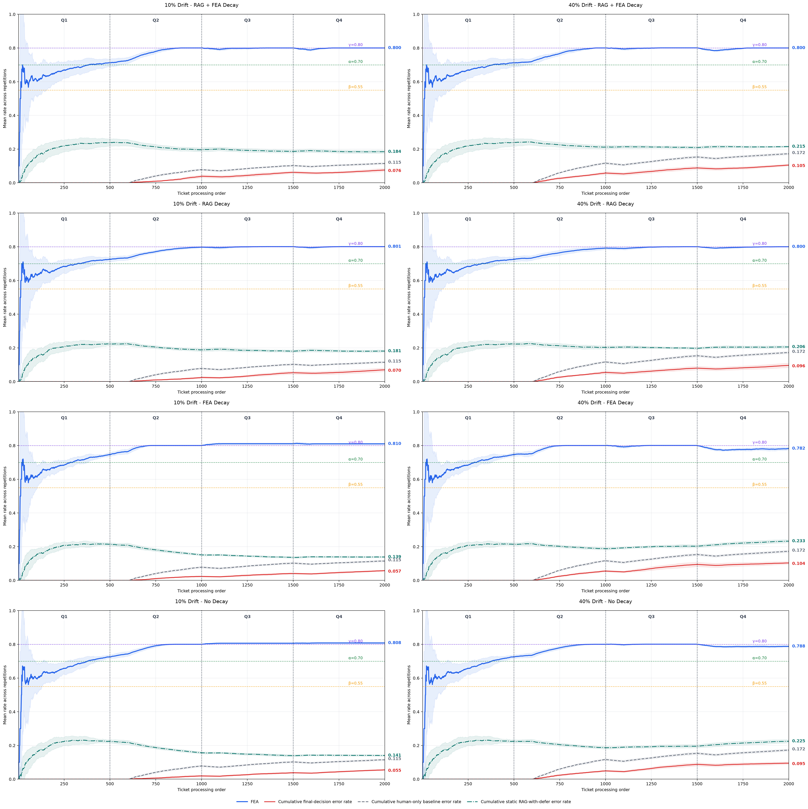

# Paper results and reproducibility artifacts

This directory contains the complete compact evidence bundle for the eight
factorial conditions reported in Section 4. Regenerate it from the canonical
completed jobs with:

```bash
make paper-stats
```

The export verifies that matched conditions use the same seeds, within-quarter
ticket order, and simulated-human assignments. It fails if either order or
assignment fingerprints differ within a paired comparison.

## Conditions

Each drift dataset has ten repetitions of four settings:

| Code | `lambda_rag` | `lambda_fea` |
|---|---:|---:|
| `D` | 0.99861 | 0.99861 |
| `R_D_F_ND` | 0.99861 | 1 |
| `R_ND_F_D` | 1 | 0.99861 |
| `ND` | 1 | 1 |

The two drift datasets and four decay settings give eight jobs and 80 total
repetitions. Each nominal repetition contains 2,000 tickets. Extra abstention
challenge tickets are excluded from the paper's nominal metrics.

## Complete trajectory plot

[`plots/all-eight-settings.png`](plots/all-eight-settings.png) shows the mean
FEA, cumulative final-decision error, cumulative human-only error, and
cumulative static-RAG-with-defer error for every condition. Shaded regions are
population standard deviations across the ten repetitions at each ticket
position. Conditions with the same decay setting are arranged side by side for
10% and 40% drift. The eight full-resolution panels and standalone legend are
also retained in [`plots/`](plots/).



## Statistical files

- [`per-run-results.csv`](per-run-results.csv): one row per repetition (80
  rows), with seeds; ticket-order and human-assignment SHA-256 fingerprints;
  human-profile assignment counts; event counts and eligible denominators;
  overall, stable, drift, abstention, acceptance, and model-finalization rates;
  final FEA, final state, and reliability-observation count.
- [`condition-summary.csv`](condition-summary.csv): mean, sample standard
  deviation, two-sided 95% Student-*t* confidence interval, minimum, and
  maximum for every reported condition-level rate and count.
- [`paired-comparisons.csv`](paired-comparisons.csv): matched coupled-decay
  minus no-decay effects for the four primary outcomes.
- [`factorial-comparisons.csv`](factorial-comparisons.csv): matched effects of
  RAG decay and FEA decay while holding the other factor fixed.
- [`baseline-comparisons.csv`](baseline-comparisons.csv): matched iRAG
  final-error minus human-only-baseline comparisons for all conditions.
- [`controller-comparisons.csv`](controller-comparisons.csv): matched static
  RAG-with-defer error minus iRAG error on the same realised retrieval
  trajectory, isolating the immediate SO/SC/DS controller contribution.
- [`final-state-frequencies.csv`](final-state-frequencies.csv): SO/SC/DS final
  state counts across the ten repetitions of every condition.
- [`auxiliary-judge-audit.json`](auxiliary-judge-audit.json): counts and rates
  used for the paper's auxiliary-judge audit.
- [`paper-statistics.json`](paper-statistics.json): machine-readable superset
  containing definitions, all summaries, paired differences, test results,
  final-state frequencies, the judge audit, and canonical job IDs.

For paired contrasts, the files report the mean paired difference, sample
standard deviation, two-sided 95% Student-*t* confidence interval, Cohen's
*d_z*, two-sided exact sign-flip randomization *p*-value, and Holm-adjusted
*p*-value. Rates and differences in CSV files are percentages or percentage
points; FEA remains on its native 0--1 scale.

The primary outcomes are final-decision error, stable-ticket error,
drift-ticket error, and model-finalized proportion. Static RAG-with-defer lets
the model finalize every non-abstaining proposal and uses the initially
assigned human answer when the model abstains. Conditional LLM gold-answer
error is retained as a model-quality diagnostic.

## Source-job artifacts

[`source-outputs/`](source-outputs/) contains a stable directory for each of
the eight canonical jobs:

- `result.json`: an exact copy of the aggregate output from `outputs/`,
  including configuration, model and dataset manifests, transition summaries,
  run-file references, timestamps, and resume history;
- `abstention-drift-stats.json`: exact detailed analysis with overall,
  per-quarter, drift-only, SC-acceptance, count, rate, and per-repetition
  statistics;
- `metadata.json.gz`: a losslessly and deterministically compressed copy of
  the full job metadata, including the 2,000 input records and provenance.

[`artifact-manifest.csv`](artifact-manifest.csv) maps these stable names to the
canonical job IDs and original output directories. It records decay values,
timestamps, SHA-256 checksums, plot paths, raw-run counts, and raw-run byte
sizes. The copied `result.json` checksums equal their source checksums.

The 80 raw ticket-level `run-*.json` files remain under `outputs/`: together
they occupy approximately 1.1 GB and are not duplicated in this compact
repository bundle. All paper-level per-repetition results, seeds, counts,
denominators, order and assignment fingerprints, and source-run provenance are
included here. The aggregate outputs retain the exact raw run filenames.

Plotting and export code lives in [`src/irag/tools/`](../src/irag/tools/),
principally `paper_statistics.py`, `analyze_experiment.py`,
`compose_plot_grid.py`, and `plot_legend.py`.
